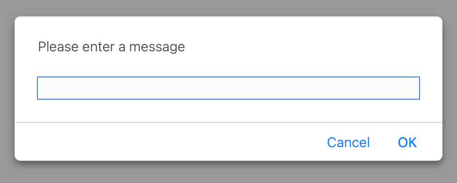

# Capstone Project 2: Arrays, Functions, and String Handling. Create a Caesar cipher.

## Table of Contents

1. Description
2. Installation
3. Usage
4. Credits

## Description 

In this task, I created a Caesar cypher in JavaScript to demonstrate the use of arrays, functions, and string handling.
A Caesar cypher is a simple substitution cypher that replaces each letter in a plaintext message with a letter shifted a fixed number of positions down the alphabet.
In this example, we shift to the right of the alphabet by 15 letters and allow the user to enter any message through a prompt.

## Installation 

To run a JavaScript file in Visual Studio Code, open the file in the editor, bring up the terminal, type node followed by the name of the file (e.g., node "cypher.js"), and hit enter to run the script.

## Usage 

Upon being prompted, enter your message and press enter. Your message will be returned as a string of letters.

## Credits

Author: Richard Bewley, 2022.
